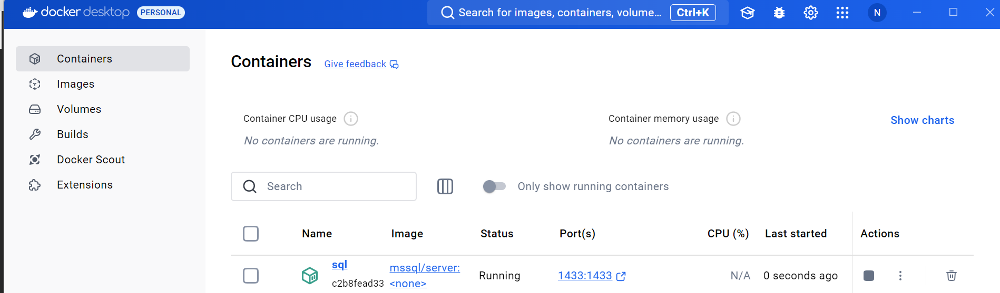

Hướng dẫn sử dụng.
Điều kiện: Đã cài docker và nodejs

1. Mở Terminal, nhập lệnh "npm install knex"

2. Mở terminal nhập lệnh "docker run -e "ACCEPT_EULA=Y" -e "MSSQL_SA_PASSWORD=SqlServer@123" -p 1433:1433 --name sql --hostname sql -d mcr.microsoft.com/mssql/server"
Lệnh này tạo container trong docker

2. Bật docker lên . Vào docker chọn bật tên như trong hình 

3. Trên sql server, nhập đúng thông tin như hình . Lưu ý, mật khẩu lấy trong file .env

4. Mở terminal, Chạy lệnh knex migrate:latest (Chạy ít nhất 2 lần).

5. Mở terminal, chạy lệnh knex seed:run (Chạy ít nhất 2 lần).