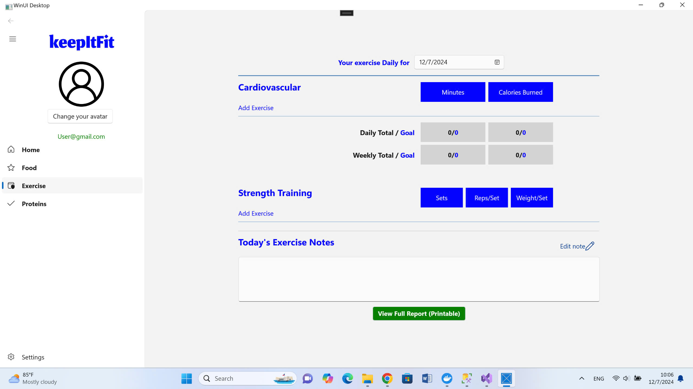
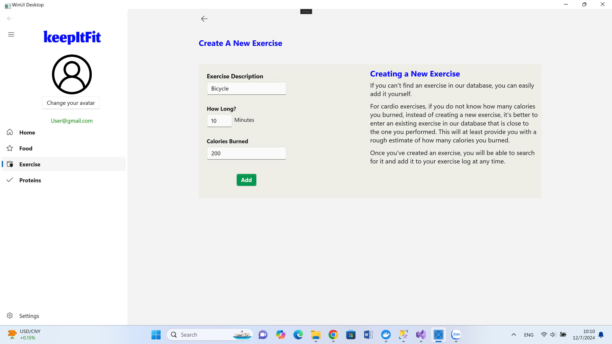

# Tên Dự Án

Phần mềm theo theo dõi sức khỏe thông qua lượng calories tiêu hao hằng ngày.
https://drive.google.com/drive/folders/1ABBcYKWm1sasS0I0_q6ABft9E3ZnoKcf?usp=sharing

  

## Mục lục


1. [Members's information](#members-information)
2. [UI/UX](#a-uiux)
3. [Design patterns/architecture](#design-patternsarchitecture)

4. [Advanced topics](#advanced-topics)

5. [Teamwork - Git flow](#teamwork---git-flow)

6. [Quality assurance](#quality-assurance)
7. [Completed Features](#completed-features)
8. [Product experience](#product-experience)
9. [Work assignment](#work-assignment-bảng-phân-công-công-việc-từ-đầu-dự-án-cho-đến-nay)
9. [Self-assessment](#self-assessment)

  
  
## Members Information
| MSSV | Tên thành viên | 
 |---------------|-----------------|
 | 22120116 | Đoàn Gia Huệ |  
 | 22120152| Phạm Gia Khang | 
 | 22120236 | Nguyễn Hoàng Nguyên | 

## A. UI/UX

### I. Giao diện chính trang Food Page
#### 1. UI


Bố cục rõ ràng, có tổ chức: Giao diện được chia thành các phần rõ ràng cho từng bữa ăn trong ngày (Breakfast, Lunch, Dinner), với các tiêu đề dễ nhận biết và cách sắp xếp khoa học. Người dùng có thể nhanh chóng phân loại và quản lý các mục ăn uống một cách trực quan và dễ dàng.

Thông tin ngày, tháng, năm: Phần ngày tháng nằm ở vị trí nổi bật, giúp người dùng theo dõi quá trình nạp năng lượng hàng ngày và dễ dàng so sánh với các ngày trước đó.

Thông tin dinh dưỡng hiển thị dễ hiểu: Các chỉ số dinh dưỡng như Calories, Carbs, Fat, Protein, Sodium, và Sugar được sắp xếp thành các cột gọn gàng, dễ đọc. Các ô màu xám cho từng giá trị dinh dưỡng giúp làm nổi bật thông tin mà không gây rối mắt, trong khi thanh cuộn giúp người dùng dễ dàng theo dõi danh sách các thực phẩm đã được thêm vào.

Sử dụng màu sắc hiệu quả: Màu xanh dương nổi bật được sử dụng cho tiêu đề và các chỉ số tổng cộng, tạo sự cân bằng và giúp phân biệt thông tin quan trọng. Nút "Finish this entry" màu xanh lá cây tạo cảm giác hoàn thành và thu hút sự chú ý, nhắc nhở người dùng bấm nút này khi hoàn tất việc ghi nhật ký.

Thống kê số liệu cuối ngày: Phần tổng hợp ở cuối trang giúp người dùng có cái nhìn tổng quan về lượng dinh dưỡng đã tiêu thụ, mục tiêu hàng ngày, và lượng còn lại. Các số liệu này giúp người dùng dễ dàng đánh giá và điều chỉnh chế độ ăn uống của mình.

Tính trực quan và dễ sử dụng: Giao diện được thiết kế tối giản, tập trung vào cung cấp thông tin một cách nhanh chóng và dễ hiểu. Người dùng mới có thể làm quen và sử dụng dễ dàng mà không cần phải qua nhiều bước hướng dẫn.


### 2. UX

Dễ dàng nhập và chỉnh sửa thức ăn: Các tùy chọn "Add Food" và "Quick Tools" bên dưới mỗi bữa ăn cho phép người dùng linh hoạt thêm hoặc chỉnh sửa thức ăn một cách nhanh chóng. Tính năng này đặc biệt thuận tiện cho việc nhập liệu nhanh. Tính năng xóa món ăn giúp xóa món ăn ra khỏi danh sách sau khi đã hiển thị thông tin món ăn, thành phần dinh dưỡng trên trang chính.

Phản hồi tức thì về chỉ số dinh dưỡng còn lại: Phần "Remaining" ở cuối trang hiển thị các chỉ số còn lại so với mục tiêu hàng ngày (màu xanh cho đủ và màu đỏ cho thừa), giúp người dùng dễ dàng nhận biết nếu đã vượt quá hoặc chưa đạt mục tiêu. Đây là một phản hồi trực quan giúp người dùng điều chỉnh lượng ăn vào hàng ngày.

Cá nhân hóa và nhắc nhở hoàn thành: Nút "Finish this entry" hoạt động như một bước hoàn tất quy trình, giúp người dùng cảm nhận quá trình ghi chép đã hoàn tất và tạo động lực để quay lại vào ngày hôm sau.

Khả năng phản hồi và cung cấp thông tin rõ ràng: Giao diện sử dụng màu sắc khác nhau cho các chỉ số còn lại, giúp người dùng dễ dàng theo dõi và kiểm soát chế độ ăn uống của mình một cách trực quan và chính xác.

Khả năng điều hướng và truy cập dễ dàng: Thanh menu bên trái cho phép người dùng dễ dàng chuyển đổi giữa các mục khác nhau như Food, Exercise, và Proteins mà không gián đoạn quá trình nhập liệu trong mục Food Diary.

Tính năng cá nhân hóa: Việc đăng nhập bằng tài khoản email giúp người dùng lưu lại thông tin và đồng bộ hóa trên nhiều thiết bị. Người dùng có thể thay đổi ảnh đại diện theo sở thích cá nhân, ví dụ như đặt một ảnh truyền cảm hứng để làm động lực, giúp trải nghiệm trở nên thú vị và gần gũi hơn.

### II. Quick add

#### 1. UI

Giao diện tối giản, dễ nhìn: Giao diện chỉ chứa các trường nhập liệu cần thiết cho thông tin dinh dưỡng (Calories, Carbs, Fat, Protein, Sodium, Sugar), hiển thị tên bữa ăn cho người dùng biết mình đang nhập cho bữa ăn nào trong ngày và rất ít chi tiết rườm rà, giúp người dùng tập trung vào nhiệm vụ chính là nhập thông tin.

Sử dụng màu sắc hợp lý: Màu xanh lá trên nút "Add to Journal" giúp dễ nhận diện hành động quan trọng là thêm dữ liệu vào nhật ký. Nút "Cancel" màu trắng cũng tạo sự tương phản, giúp người dùng dễ dàng chọn lựa khi muốn hủy thao tác.


  #### 2. UX
  Đơn giản, dễ thao tác: Giao diện "Quick Add" được tối ưu hóa cho mục tiêu nhập liệu nhanh. Người dùng có thể nhập liệu nhanh chóng mà không cần thêm chi tiết như tên món ăn hoặc thành phần cụ thể. Điều này phù hợp cho những người dùng muốn ghi chép lượng calo tổng quát mà không cần quá chi tiết. 
  
  ### III. Add Food
  #### 1. UI
  
  Giao diện thân thiện và dễ sử dụng: Với bố cục đơn giản và rõ ràng, giao diện giúp người dùng dễ dàng thao tác mà không gặp khó khăn. Tông màu và thiết kế không gây rối mắt, tạo trải nghiệm người dùng thoải mái và dễ chịu.

Thiết kế thanh tìm kiếm rõ ràng: Thanh tìm kiếm dễ thấy và dễ sử dụng, giúp người dùng nhanh chóng nhập từ khóa để tìm thực phẩm. Sau khi tìm kiếm, các thông số về calories, carbs, fat, protein, sodium, và sugar được trình bày rõ ràng ngay bên cạnh tên thực phẩm. Điều này giúp người dùng nắm bắt thông tin nhanh chóng mà không cần nhấp thêm vào từng mục.


Nút chọn đơn vị linh hoạt: Menu lựa chọn đơn vị (grams, oz, lb, kilograms, cup,..) phù hợp với từng loại thực phẩm. Thiết kế gọn gàng và dễ thao tác, cho phép người dùng điều chỉnh đơn vị phù hợp với nhu cầu của mình.

Bố cục nút hợp lý: Các nút “Add Checked” và “Delete From The List” được đặt ngay dưới danh sách, dễ dàng truy cập và sử dụng mà không cần cuộn nhiều.

#### 2. UX
Tìm kiếm thực phẩm nhanh chóng: Với chức năng tìm kiếm, người dùng có thể nhanh chóng xác định thực phẩm cần thêm một cách nhanh chóng

Tính năng Quick Add Calories tiện lợi: Người dùng có thể thêm nhanh một lượng calories vào bữa ăn mà không phải chọn từng món, đáp ứng tốt nhu cầu nhanh chóng và đơn giản hóa quy trình theo dõi dinh dưỡng. (khi nhấn vào thì sẽ được chuyển sang tính năng quickadd với các chức năng đã được mô tả ở trên)

Thêm, Xóa món ăn dễ dàng: Bằng cách chọn các món ăn cần thêm vào và chọn số lượng và đơn vị tương ứng, nút bấm "add checked" sẽ giúp người dùng thêm vào trang food page. Tương tự với thêm, sau khi chọn, nút "delete from the list" giúp xóa món ăn khỏi danh sách nhanh chóng.

Tùy chỉnh linh hoạt số lượng và đơn vị: Người dùng có thể điều chỉnh số lượng thực phẩm theo nhu cầu và chọn đơn vị mong muốn. Điều này giúp người dùng dễ dàng theo dõi chính xác lượng dinh dưỡng mà họ tiêu thụ.

### **Bổ sung cho milestone 2:**
-- --
### IV. Trang HomePage
#### 1. UI


UI hiển thị rõ 3 chỉ số nổi trội là **Base Goal**, **Food** và **Exercise** trong đó:
+ **Base Goal**: Lượng Calo mục tiêu do người dùng thiết lập, người dùng có thể thay đổi mục Base Goal này
+ **Food**: Tổng lượng Calo nạp vào cơ thể ở mục Food, người dùng có thể theo dõi chỉ số tổng này bên page Food
+ **Exercise**: Tổng lượng Calo tiêu thụ ở mục Exercise, người dùng có thể theo dõi lượng Calo bên page Exercise ở phần *Calories Burned*, chỉ số sẽ được cập nhật ở Home Page
+ **Remaining**: Được tính bằng  **Base Goal** + **Food** - **Exercise**, mỗi khi có thay đổi bên phần kia, chỉ số này sẽ được cập nhật lại để người dùng có thể theo dõi tiến độ của mình trong ngày hôm đó

  _Chỉ số được cập nhật_

### VI. Exercise Page
#### 1. UI


*Giao diện chính trang Exercise*

- Bố cục rõ ràng, dễ theo dõi: Giao diện được chia thành các khu vực chức năng chính, gồm:
  + **Cardiovascular**: Hiển thị số phút và lượng calories tiêu hao trong bài tập tim mạch.
  + **Strength Training**: Cung cấp các thông số về số set, số reps mỗi set và trọng lượng tập.
Today's Exercise Notes: Phần ghi chú để người dùng viết thêm các thông tin quan trọng liên quan đến bài tập.

- Cách bố trí theo dạng khối (blocks) dễ nhìn, phù hợp với thói quen theo dõi nhanh của người dùng.
- Màu sắc sử dụng nổi bật và tương phản tốt:
Màu xanh dương làm nổi bật tiêu đề và các nút nhập thông số, giúp thu hút sự chú ý 	vào các thông tin quan trọng.
Màu xanh lá cây cho nút <span style="color: green"> "View Full Report (Printable)"</span> tạo cảm giác khuyến khích 	người dùng hoàn tất quy trình hoặc kiểm tra báo cáo tổng hợp.
- Đồng nhất về font chữ và kích thước:
	Font chữ đơn giản, không rườm rà, giúp nội dung dễ đọc và truyền đạt thông tin 	nhanh chóng.
	Các tiêu đề lớn hơn (ví dụ "Cardiovascular", "Strength Training") được in đậm, làm 	rõ ràng từng phần trong giao diện.

- Sử dụng các ô nhập liệu gọn gàng:
	Ô nhập ***Minutes***, ***Calories Burned***, và các thông số tập luyện như ***Sets***, ***Reps/Set***, ***Weight/Set*** được thiết kế vừa đủ lớn, dễ dàng tương tác.

- Thanh điều hướng nhất quán:
	Thanh bên trái bao gồm các mục chính như **Home**, **Food**, **Exercise**, giúp người 	dùng dễ dàng chuyển đổi giữa các tính năng.

#### 2. UX
- Chức năng chọn ngày: Lựa chọn ngày ở đầu giao diện được thiết kế trực quan, giúp 	người dùng chuyển đổi giữa các ngày tập luyện một cách thuận tiện.

- Tích hợp nhiều thông tin trong một giao diện: Giao diện cung cấp đủ thông tin như 	tổng lượng calo đốt cháy, thời gian tập luyện, số set, số lần lặp, và ghi chú cá 	nhân, giúp người dùng dễ dàng theo dõi toàn diện.

- Dễ dàng ghi nhật ký bài tập:
	Các khu vực như Add Exercise dưới cả hai phần **"Cardiovascular"** và **"Strength Training"** cho phép người dùng nhanh chóng thêm, xóa bài tập mà không cần tìm kiếm 	phức tạp.

- Phản hồi trực tiếp từ giao diện:
	**Daily Total / Goal** và **Weekly Total / Goal** là các chỉ số tức thời, giúp người dùng 	theo dõi tiến độ tập luyện hàng ngày và cả tuần. Việc này khuyến khích người dùng 	đạt được mục tiêu đã đặt ra.

- Cá nhân hóa và tính linh hoạt:
	Người dùng có thể tự ghi chú trong phần Today's Exercise Notes, giúp họ bổ sung 	thông tin cá nhân, ví dụ như cảm giác sau bài tập hoặc các lưu ý cho lần tập tiếp 	theo.
	Giao diện hiển thị ngày tháng (Your exercise journal for 12/7/2024) hỗ trợ việc lưu 	trữ và kiểm tra lại thông tin từ những ngày trước.

- Khả năng in báo cáo: 
	Nút **"View Full Report (Printable)"** giúp người dùng dễ dàng lưu trữ báo cáo dưới 	dạng in ấn, phù hợp cho những ai muốn theo dõi tiến trình lâu dài hoặc chia sẻ với 	huấn luyện viên cá nhân.

- Khả năng điều hướng nhanh:
	Thanh menu bên trái giúp người dùng chuyển qua các tính năng khác mà không phải rời	khỏi giao diện hiện tại.

### VII. Add cardiovation
#### 1. Tìm kiếm
##### a. UI

*Giao diện chính*
- Thiết kế tối giản:
Giao diện không có quá nhiều chi tiết phức tạp, tập trung duy nhất vào thanh tìm kiếm và hướng dẫn, giúp người dùng dễ dàng nhận biết bước tiếp theo.

- Thanh tìm kiếm nổi bật:
Thanh tìm kiếm nằm ở vị trí trung tâm, kích thước lớn, thu hút ánh nhìn của người dùng ngay lập tức.
Nút "Search" màu xanh lá cây nổi bật trên nền trắng, tạo sự rõ ràng và khuyến khích hành động.

- Hướng dẫn bổ sung dễ hiểu:
Dòng chữ hướng dẫn **"Or, add your most recently used cardio exercises"** sử dụng font chữ đơn giản, dễ đọc, đặt ngay bên dưới thanh tìm kiếm, cung cấp thông tin rõ ràng mà không gây áp lực.
##### b. UX
- Phản hồi ngay lập tức:
Khi không có kết quả tìm kiếm phù hợp, giao diện nhanh chóng cung cấp trạng thái rõ ràng, không để người dùng bị lạc lõng.
ví dụ: 


*Hệ thống nhắc nhở người dùng nhập sai*
 
- Hỗ trợ hành động tiếp theo:
Giao diện gợi ý rõ ràng những lựa chọn tiếp theo: thử tìm kiếm lại hoặc chọn bài tập cardio gần đây nhất. Điều này đảm bảo người dùng luôn biết mình cần làm gì.Trong trường hợp trên, sau khi chỉ nhập chữ "r" thì giao diện sẽ hiển thị thông báo hướng dẫn người dùng nhập lại cho đúng ( chi tiết mô tả ở phần VII.2)
Thiết kế không chứa yếu tố dư thừa, khiến người dùng chỉ cần tập trung vào một hành động duy nhất: nhập lại từ khóa hoặc chọn bài tập khác.

#### 2. Thêm bài tập CARDIO Exercise
##### a. UI

*Giao diện chính trang tìm kiếm*

- Bố cục rõ ràng và trực quan:
Giao diện được chia thành hai phần chính, giúp người dùng dễ dàng xác định các khu vực chức năng:
Khu vực danh sách bài tập: Danh sách bài tập hiển thị rõ ràng, sắp xếp theo chiều dọc, thuận tiện cho việc duyệt nhanh.
Khu vực nhập thông tin: Phần nhập liệu được đóng khung riêng, tạo sự tập trung và đảm bảo không bị nhầm lẫn khi thao tác.

- Sử dụng màu sắc hiệu quả:
<span style="color: blue">Màu xanh dương</span> cho tiêu đề và các liên kết (bài tập) tạo cảm giác thân thiện, dễ đọc, và thống nhất với phong cách ứng dụng.
<span style="color: red">Màu đỏ</span> được sử dụng làm điểm nhấn cho tên bài tập đang chọn (<span style="color: red">Canoeing, on camping trip</span>), giúp người dùng dễ nhận biết mình đang làm việc với bài tập nào.
Nút hành động ("<span style="color: green">Add Exercise</span>") có màu <span style="color: green">xanh lá cây</span> nổi bật, dễ dàng nhận diện, làm rõ bước tiếp theo mà người dùng cần thực hiện.

- Hiển thị rõ ràng thông tin cần thiết:
Font chữ to, dễ đọc cho cả danh sách bài tập và các trường nhập thông tin.
Các trường nhập liệu ("**How long**," "**Calories burned**,") được đặt trong một bố cục gọn gàng, không gây rối mắt.
Danh sách bài tập được sắp xếp hợp lý, cho phép người dùng cuộn để xem toàn bộ mà không bị cản trở.

- Tính nhất quán cao:
Các phần của giao diện tuân theo cùng một phong cách thiết kế: font chữ, màu sắc, kích thước nút bấm và bố cục đều được giữ đồng nhất, giúp trải nghiệm dễ dàng và liền mạch.

##### b. UX
- Quy trình mạch lạc và liền mạch:
Giao diện dẫn dắt người dùng một cách tự nhiên qua từng bước: tìm bài tập, chọn bài tập, nhập thông tin, và thêm vào danh sách.
Không cần chuyển qua nhiều màn hình để thực hiện một tác vụ, giảm thiểu sự gián đoạn.

- Tìm kiếm và gợi ý hiệu quả:
Thanh tìm kiếm giúp người dùng nhập từ khóa một cách nhanh chóng để tìm bài tập, ngay cả khi không nhớ chính xác tên đầy đủ.
Gợi ý danh sách bài tập phù hợp ngay khi người dùng nhập từ khóa, tiết kiệm thời gian và công sức.

- Nhập liệu dễ dàng và rõ ràng
Phần nhập liệu được chia thành các trường nhỏ gọn với nhãn rõ ràng và cụ thể.
Các trường nhập không có yếu tố dư thừa, tập trung vào các thông số quan trọng nhất .
=> Người dùng không phải suy nghĩ nhiều về cách điền thông tin, giảm áp lực trong quá trình sử dụng.

- Mở rộng chức năng, tăng tính cá nhân hóa:
Trong trường hợp người dùng muốn thêm một bài tập mà không có sẵn ở database, chương trình có hỗ trợ tính nắng đó như sau. Nhấp vào dòng chữ hướng dẫn "Can't find what you're looking for? Add an exercise to the database" Cho phép người dùng góp phần làm phong phú thêm cơ sở dữ liệu của ứng dụng. Người dùng tự thêm vào database một bài tập mới và có thể ước lượng qui định và nhập dữ liệu vào các trường ("**Exercise description**", "**How long**," "**Calories burned**"). Sau đó nhấn "add" để xác nhận thêm một bài tập mới.


*Thêm 1 bài tập mới*

Kết quả sau khi vào mục tìm kiếm như sau


*Bài tập mới đã được thêm vào*

### VIII. Add Strength Training Exercise
#### 1. Tìm kiếm
##### a. UI

*Giao diện chính của trang tìm kiếm*
- Thiết kế tối giản:
Giao diện không có quá nhiều chi tiết phức tạp, tập trung duy nhất vào thanh tìm kiếm và hướng dẫn, giúp người dùng dễ dàng nhận biết bước tiếp theo.

- Thanh tìm kiếm nổi bật:
Thanh tìm kiếm nằm ở vị trí trung tâm, kích thước lớn, thu hút ánh nhìn của người dùng ngay lập tức.
Nút "**Search**" màu xanh lá cây nổi bật trên nền trắng, tạo sự rõ ràng và khuyến khích hành động.

- Hướng dẫn bổ sung dễ hiểu:
Dòng chữ hướng dẫn "**Or, add your most recently used cardio exercises**" sử dụng font chữ đơn giản, dễ đọc, đặt ngay bên dưới thanh tìm kiếm, cung cấp thông tin rõ ràng mà không gây áp lực.

##### b. UX
- Phản hồi ngay lập tức:
Khi không có kết quả tìm kiếm phù hợp, giao diện nhanh chóng cung cấp trạng thái rõ ràng, không để người dùng bị lạc lõng.
 
- Hỗ trợ hành động tiếp theo:
Giao diện gợi ý rõ ràng những lựa chọn tiếp theo: thử tìm kiếm lại hoặc chọn bài tập cardio gần đây nhất. Điều này đảm bảo người dùng luôn biết mình cần làm gì.Trong trường hợp trên, sau khi chỉ nhập chữ "r" thì giao diện sẽ hiển thị thông báo hướng dẫn người dùng nhập lại cho đúng ( chi tiết mô tả ở phần **VIII.2**)
Thiết kế không chứa yếu tố dư thừa, khiến người dùng chỉ cần tập trung vào một hành động duy nhất: nhập lại từ khóa hoặc chọn bài tập khác.

#### 2. Thêm bài tập Strength Training Exercise
##### a. UI

*Chọn bài tập*

- Bố cục rõ ràng và trực quan:
Giao diện được chia thành hai phần chính, giúp người dùng dễ dàng xác định các khu vực chức năng:
Khu vực danh sách bài tập: Danh sách bài tập hiển thị rõ ràng, sắp xếp theo chiều dọc, thuận tiện cho việc duyệt nhanh.
Khu vực nhập thông tin: Phần nhập liệu được đóng khung riêng, tạo sự tập trung và đảm bảo không bị nhầm lẫn khi thao tác.

- Sử dụng màu sắc hiệu quả:
<span style="color: blue">Màu xanh dương</span> cho tiêu đề và các liên kết (bài tập) tạo cảm giác thân thiện, dễ đọc, và thống nhất với phong cách ứng dụng.
<span style="color: red">Màu đỏ</span> được sử dụng làm điểm nhấn cho tên bài tập đang chọn (<span style="color: red">Flat Dumbbell Fly</span>), giúp người dùng dễ nhận biết mình đang làm việc với bài tập nào.
Nút hành động ("<span style="color: green">Add Exercise</span>") có màu <span style="color: green">xanh lá cây</span> nổi bật, dễ dàng nhận diện, làm rõ bước tiếp theo mà người dùng cần thực hiện.

- Hiển thị rõ ràng thông tin cần thiết:
Font chữ to, dễ đọc cho cả danh sách bài tập và các trường nhập thông tin.
Các trường nhập liệu ("**Number of sets**," "**Repetitions per set**," "**Weight per set**") được đặt trong một bố cục gọn gàng, không gây rối mắt.
Danh sách bài tập được sắp xếp hợp lý, cho phép người dùng cuộn để xem toàn bộ mà không bị cản trở.

- Tính nhất quán cao:
Các phần của giao diện tuân theo cùng một phong cách thiết kế: font chữ, màu sắc, kích thước nút bấm và bố cục đều được giữ đồng nhất, giúp trải nghiệm dễ dàng và liền mạch.

##### b. UX
- Quy trình mạch lạc và liền mạch:
Giao diện dẫn dắt người dùng một cách tự nhiên qua từng bước: tìm bài tập, chọn bài tập, nhập thông tin, và thêm vào danh sách.
Không cần chuyển qua nhiều màn hình để thực hiện một tác vụ, giảm thiểu sự gián đoạn.

- Tìm kiếm và gợi ý hiệu quả:
Thanh tìm kiếm giúp người dùng nhập từ khóa một cách nhanh chóng để tìm bài tập, ngay cả khi không nhớ chính xác tên đầy đủ.
Gợi ý danh sách bài tập phù hợp ngay khi người dùng nhập từ khóa, tiết kiệm thời gian và công sức.

- Nhập liệu dễ dàng và rõ ràng
Phần nhập liệu được chia thành các trường nhỏ gọn (**Number of sets**, **Repetitions per set**, **Weight per set**) với nhãn rõ ràng và cụ thể.
Các trường nhập không có yếu tố dư thừa, tập trung vào các thông số quan trọng nhất đối với Strength Training.
=> Người dùng không phải suy nghĩ nhiều về cách điền thông tin, giảm áp lực trong quá trình sử dụng.


- Mở rộng chức năng: Cho phép người dùng góp phần làm phong phú thêm cơ sở dữ liệu của ứng dụng. Người dùng tự thêm vào database một bài tập mới và có thể ước lượng qui định và nhập dữ liệu vào các trường (***exercise description***, ***sets***, ***repetition/sets***, ***weight/sets***). Hỗ trợ tương tự như đã mô tả ở phần mở rộng chức năng **VII.2.b**

*Tạo bài tập mới*
- Tập trung vào hành động chính:
Nút hành động nổi bật ("**Add Exercise**") ngay dưới phần nhập thông tin, dễ nhận biết, giúp người dùng nhanh chóng hoàn thành mục tiêu của mình.
Không có các yếu tố gây nhiễu hoặc không cần thiết trên màn hình.

- Tăng tính cá nhân hóa:
Tên bài tập đang chọn (*Flat Dumbbell Fly*) được hiển thị rõ ràng và nổi bật, tạo sự tập trung và cá nhân hóa trải nghiệm.

- Đáp ứng nhanh và đơn giản:
Người dùng chỉ cần tối đa 3 bước để hoàn thành việc thêm bài tập: tìm kiếm → chọn bài tập → nhập thông tin → bấm nút "Add Exercise."
Phần nhập liệu dễ hiểu, không có trường nào dư thừa hay không cần thiết.

- Thân thiện với cả người mới và người đã quen thuộc
Với những người mới, giao diện đơn giản và rõ ràng giúp họ nhanh chóng làm quen mà không cần phải xem hướng dẫn chi tiết.
Với người dùng đã quen thuộc, họ có thể thực hiện tác vụ nhanh chóng chỉ với vài bước.
=> Đảm bảo ứng dụng dễ dùng cho mọi cấp độ người dùng.


## Design patterns/architecture

### MVVM Design patterns ( Cập nhật milestone 2)

Sử dụng mẫu thiết kế MVVM, trong project có các folder:
- **Model**: Chứa các lớp
	+  **IDao**: Lớp giao diện chứa các phương thức lấy thông tin từ cơ sở dữ liệu thông qua các hàm GetAll()
	+ **MockDao**: Cài đặt chi tiết các hàm lấy thông tin, trả về 1 danh sách dữ liệu
	
- **ViewModel**: Chứa các lớp
	+ **Meal**: chứa thông tin 1 bữa ăn (tên bữa ăn)
	
	+ **ValueToColorConverter**: Converter có chức năng phát hiện thay đổi về giá trị số để thay đổi màu tương ứng (< 0: <span style="color: red">đỏ</span> ;  > 0: <span style="color: green">xanh</span>; = 0: đen)
	+ **Nutritions**: Chưa thông tin của 1 chất dinh dưỡng

	+ **InputNutritionData** và **InputNutritionDataViewModel**: Class đóng vai trò như 1 bộ chuyển đổi dữ liệu từ các page khác khi chuyển đến FoodDiary thành 1 cách hiện thị thống nhất để hiển thị lên FoodDiary
		+ Dữ liệu từ các trang SearchFood, AddFood, FoodPage khi người dùng bấm các nút Add tương ứng ở các trang đó khi gửi đến FoodDiary sẽ ở nhiều dạng khác nhau (Tên bữa ăn, danh sách chất dưỡng; Tên bữa bữa ăn, tên món ăn, danh sách chất dinh dưỡng; Tên bữa ăn, danh sách món ăn, danh sách chất dinh dưỡng tương ứng).
		+ Khi đó, InputNutritionDataViewModel sẽ làm nhiệm vụ chuyển đổi các dữ liệu được chuyển đến thành 1 kiểu đối tượng chung InputNutritionData để thống nhất về cách hiển thị khi binding danh sách lên giao diện. 
		+ Các hàm như update(), updateWithFood(), updateWithListFood()  là các hàm chuyển đổi để thêm vào danh sách
	+ Các class **NutritionsViewModel**, **FoodPageViewModel**, **AddFoodViewModel**, **SearchFoodViewModel**: chịu trách nhiệm tạo và cập nhật dữ liệu bên dưới cho ứng dụng
- **View**: Chứa các file code xaml và code C# xử lí các logic cho các các page:
	+ **MainWindow.xaml**: cửa sổ chính của ứng dụng, dẫn đến các page khác 
	+ **FoodPage.xaml**, **AddFood.xaml**, **SearchFood.xaml**, **FoodDiary.xaml**: là các trang chính trong giao diện phần Food của ứng dụng, là nơi người dùng tương tác với ứng dung. Người dùng có thể chọn *QuickAdd* để nhập nhanh lượng dinh dưỡng hoặc *AddFood* để chọn các món ăn cho mình, hệ thống sẽ tính toán lượng dinh dưỡng của các món ăn đó
	+ Trong phần Food, lượng dinh dưỡng nạp vào của mỗi chất dựa trên 1 cơ thể khỏe mạnh, người dùng có thể dựa vào đó để đánh giá 1 ngày ăn uống của mình như vậy đã hợp lí chưa
	
### **Bổ sung cho milestone 2:**
-- --
- **Model**: Chứa các lớp:
	+ **CardioExercise**: Chứa dữ liệu về các bài tập Cardio, bao gồm tên bài tập, thời gian tập và lượng calo tiêu thụ
	+ **StrengthTrainingExercise**: Chứa thông tin các bài tập thể lực
- **Service:** Chứa các lớp:
	+ **IDAO**: Lớp giao diện chứa các phương thức lấy thông tin từ cơ sở dữ liệu thông qua các hàm GetAll()
	+ **MockDao**: Cài đặt chi tiết các hàm lấy thông tin, trả về 1 danh sách dữ liệu
	+ **SqlDao**: Kết nối đến cơ sở dữ liệu để lấy thông tin từ cơ sở dữ liệu lên, dữ liệu lúc này được đưa xuống database mà không còn là dữ liệu tạm thời nữa
- **ViewModel:** Chứa các lớp:	
	 + **SearchExerciseViewModel**: Có nhiệm vụ trả về kết quả khi người dùng tra cứu tên bài tập thể dục. Lớp sẽ kết nối cơ sở dữ liệu, dựa trên từ khóa mà người dùng nhập vào để thực hiện truy vấn trả ra 1 hoặc nhiều kết quả có liên quan đến từ khóa người dùng nhập
	 +  **FoodDiaryViewModel, ExercisePageViewModel**: Các lớp giúp lưu các kết quả người dùng đã nhập theo từng ngày. *Chẳng hạn*, ngày hôm nay người dùng đã nhập các thông tin cho bữa ăn cũng như là các bài tập thể thao. Qua ngày hôm sau, các trang sẽ được làm mới và người sẽ tiếp tục cập nhật hoạt động cho ngày hôm nay của mình. Đồng thời, người dùng cũng có thể chọn lịch vào ngày cũ để xem thông tin mình đã thao tác và chỉnh sửa ngày đó (thêm/ xóa các món ăn, bài tập) 
	
- **View:** Chứa các lớp:	
	+ **CreateExercise, ExercisePage, SearchCardioExercise, SearchStrengthTrainingExercise**: Các lớp giao diện hiển thị và tương tác với người dùng ở phần chọn bài tập thể dục. Người dùng có thể tìm kiếm và chọn các bài tập thể dục ở 2 thể loại (Cardio/ Strength) để thêm các bài tập vào hoạt động hằng ngày của mình tương tự như bên phần *Food*. Đồng thời, người dùng có thể tự tạo bài thể dục riêng cho mình nếu không tìm thấy kết quả mong muốn thông qua giao diện ở của **CreateExercise**

	+ **CreateMyFood**: Giao diện giúp người dùng tự tạo riêng món ăn cho cho mình bằng cách điền các thông tin cụ thể như tên món ăn, lượng dinh dưỡng ước tính cho món ăn đó
	+ **NutrionResult**: Trang kết quả thông báo về tình trạng sức khỏe cho người dùng vào ngày hôm đó.
	+ **HomePage**: Trang chủ của ứng dụng, hiển thị các thông tin về chỉ số tổng thể bao gồm tổng lượng Calo đã nạp vào ở phần **Food** và tổng Calo đã tiêu thụ ở phần **Exercise**. Chỉ số *Remaining* được tính tự động thể hiện chỉ số Calo còn lại trong ngày hôm đó của người dùng 
## Advanced topics

 ### 1. MVVM design pattern
 - Nhóm đã tìm hiểu và triển khai mô hình MVVM. Mô hình này nhóm đã tự tìm hiểu và triển khai một cách hợp lí nhất khi phân tách ra các lớp chính là View, Model, và để đảm bảo rằng tầng giao diện chỉ phục vụ cho việc hiển thị dữ liệu lên, còn dữ liệu hiển thị đó là gì thì sẽ thông qua lớp thứ 3 là ViewModel.
 
 - Chỉ tiết về triển khai mô hình này đã thầy có thể xem ở mục Design patterns/architecture
 ### 2. WindowHandle
 - Để có thể phóng to của sổ lập tức khi người dùng chạy chương trình, nhóm đã sử dụng WindowHandle để thực hiện việc phóng to cửa sổ Phần mềm khi chạy mới chạy 
 - Ứng dụng khi chạy sẽ phóng to full màn hình 


- Code behind:

### 3. Xử lí khi dữ liệu nhập sai
- Nếu người dùng nhập dữ liệu bị sai mà bạn muốn người dùng phải Focus vào TextBox đang nhập đến khi nhập đúng? Nhóm đã tìm hiểu và sử dụng thêm 2 thuộc tính là Textchanged và LostFocus. Khi người dùng nhập sai thì hệ thống sẽ báo lỗi và ép người dùng phải nhập đúng thì mới thả Focus. Minh họa cho trường hợp này nằm ở mục Quality assurance
- Code behind:

### 4. Bất đồng bộ trong C# và dùng fileOpenPicker để tương tác với file ảnh trong window
- Tính năng chọn ảnh đại diện trong ứng dụng sử dụng bất đồng bộ,  cho phép người dùng thao tác tải ảnh từ hệ thống của máy lên mà không làm treo các tác vụ khác của ứng dụng bởi vì các thao tác đọc tệp thường mất rất nhiều thời gian

- **FileOpenPicker**: Sử dụng FileOpenPicker từ Windows Runtime API để chọn tệp từ thư viện ảnh, hỗ trợ đọc các tệp ảnh **.jpg**, **.png**, **.jpeg**


_Chọn ảnh từ hệ thống_

_Ảnh được cập nhật_

## Bổ sung cho milestone 2

### 5. Áp dụng mẫu Singleton Pattern 
- Khi chương trình chạy, để đảm bảo rằng người dùng khi thay đổi Calendar của ngày chọn Food hay Exercise thì hệ thống sẽ **nhớ** được ngày của người dùng đang chọn mà không cần phải **lưu** lại xuống Database. Nhóm sử dụng Singleton Pattern để tạo một đối tượng duy nhất quản lí trạng thái Calendar trong vòng đời của ứng dụng (đến khi ứng dụng bị tắt đi).


## Teamwork - Git flow
+ Sử dụng **github**, 1 branch **main**
  + Thành viên 1 tạo repository ở chế độ public ,thành viên 2 clone repository về, thành viên 3 fork repository về
  + 2 thành viên sẽ có quyền push trực tiếp code lên branch **main**, 1 người tạo **pull request**, chủ repo chấp nhận code và merge vào branch **main**
+ Minh chứng commit:


### Bổ sung cho milestone 2
-- --

+ Sử dụng **Jira** cho việc phân chia công việc và theo dõi tiến độ dự án

  
  

## Quality assurance

### 1. Quy trình commit và kiểm duyệt code:

- Các thành viên trong nhóm làm việc trên từng chức năng hoặc nhiệm vụ được giao và commit mã nguồn lên kho lưu trữ chung.
- Trước khi bất kỳ mã nguồn nào được tích hợp vào nhánh chính (main), sẽ có một thành viên được chỉ định tiến hành kiểm duyệt mã. Người được phân sẽ xem xét mã nguồn để đảm bảo rằng chương trình tuân theo các tiêu chuẩn mã hóa và không gây ảnh hưởng đến các phần khác của hệ thống.
- Việc kiểm duyệt giúp phát hiện sớm các lỗi tiềm ẩn hoặc các phần mã có thể tối ưu hóa tốt hơn.

### 2. Chạy thử và kiểm tra mã nguồn:

- Sau khi kiểm duyệt mã nguồn, người kiểm duyệt sẽ chạy mã trên môi trường thử nghiệm để đảm bảo rằng nó hoạt động đúng chức năng như yêu cầu. Tại đây, nhóm sử dụng dụng phương pháp  kiểm tra thủ công để phát hiện các lỗi có thể xảy ra như tìm kiếm với từ khóa có trong cơ sở dữ liệu, tìm kiếm với từ khóa không có trong cơ sở dữ liệu, kiểm thử với từ khóa không hợp lệ hoặc bỏ trống,...

- Ví dụ cụ thể: Phần bắt lỗi người dùng trong chức năng AddFood và SearchFood:
	+ Trong chức năng AddFood, nhóm đã tích hợp một cơ chế kiểm tra lỗi khi người dùng nhập số lượng (FoodQuantity). Cơ chế này có chức năng kiểm tra giá trị mà người dùng nhập vào:
		+ Giá trị phải lớn hơn hoặc bằng 1: Nếu người dùng nhập số lượng nhỏ hơn 1 (ví dụ: -12 như trong ảnh), hệ thống sẽ hiển thị thông báo lỗi yêu cầu người dùng nhập một giá trị hợp lệ lớn hơn 0. Điều này giúp ngăn chặn các giá trị không phù hợp ảnh hưởng đến dữ liệu dinh dưỡng hoặc tính toán trong hệ thống.
		
		
		+ Chỉ chấp nhận số hợp lệ: Nếu người dùng nhập ký tự không phải là số (như chữ cái hoặc ký tự đặc biệt), hệ thống cũng sẽ hiển thị thông báo lỗi để yêu cầu người dùng nhập một giá trị hợp lệ.
		
		+ Khi lỗi xuất hiện, hệ thống không cho phép người dùng tiếp tục thao tác cho đến khi nhập đúng giá trị. Điều này giúp đảm bảo tính chính xác của dữ liệu và ngăn ngừa sai sót có thể ảnh hưởng đến tính toán hoặc báo cáo của ứng dụng.
	+ Trong quá trình kiểm thử chức năng SearchFood, nhóm đã tích hợp một cơ chế kiểm tra lỗi và hiển thị thông báo như sau:
	
		+ Khi không tìm thấy kết quả: Nếu người dùng nhập một từ khóa mà không có thực phẩm nào trong cơ sở dữ liệu trùng khớp, hệ thống sẽ hiển thị thông báo "No result found" như trong hình 1. Thông báo này giúp người dùng dễ dàng hiểu rằng từ khóa họ vừa nhập không có trong cơ sở dữ liệu, giúp tránh sự nhầm lẫn.
		
		+ Bắt lỗi khi người dùng nhập sai định dạng hoặc ký tự đặc biệt: Để đảm bảo rằng chức năng tìm kiếm hoạt động chính xác và tránh các lỗi phát sinh do nhập liệu không đúng, thiết lập giới hạn cho phép nhập chỉ các ký tự chữ và số. Nếu người dùng nhập các ký tự không phù hợp (ví dụ: ký tự đặc biệt), hệ thống sẽ hiển thị thông báo "No result found".
		
		
		+ Yêu cầu nhập từ khóa khi bỏ trống: Nếu người dùng bấm nút “Search” mà không nhập từ khóa, hệ thống sẽ hiển thị thông báo "No result found" như trong hình . Điều này giúp đảm bảo tính nhất quán và tránh việc người dùng vô tình thực hiện tìm kiếm mà không có từ khóa. 
- Việc kiểm thử kỹ lưỡng giúp đảm bảo rằng mã mới không gây ra lỗi và hoạt động ổn định trên các trường hợp sử dụng khác nhau.
### 3. Merge vào nhánh chính (main)
- Sau khi mã nguồn đã được kiểm thử và đạt tiêu chuẩn chất lượng, người kiểm duyệt sẽ phê duyệt cho phép merge vào nhánh chính.
- Quy trình này giúp duy trì tính ổn định và chất lượng của mã nguồn chính, giảm thiểu khả năng xảy ra lỗi khi sản phẩm được đưa vào sử dụng thực tế.

### Bổ sung cho milestone 2
-- --
### 2. Chạy thử và kiểm tra mã nguồn:
- Với việc sử dụng **Regular Expression**, trong quá trình chọn các bài tập thể dục, hoặc tạo mới các bài tập thể dục, với những chỉ cho phép nhập số, hệ thống sẽ ngăn người dùng nhập các kí tự là chữ cái và chỉ cho phép người dùng nhập số
- Đồng thời khi tạo mới 1 bài tập hoặc 1 món ăn mới, hệ thống đảm bảo người dùng đã nhập dủ các thông tin cần thiết để thêm vào cơ sở dữ liệu, và sẽ hiện cảnh báo nếu người dùng nhập sót trường thông tin nào đó


*Kiểm tra lỗi nhập thiếu trường thông tin ở phần Food*


*Kiểm tra lỗi ở phần tạo mới Exercise*

## Completed Features
### Những tính năng đã hoàn thành:

 | Tên tính năng | Số giờ làm việc | 
 |---------------|-----------------|
 | Tính năng tính toán tổng lượng calories, các thành phần dinh dưỡng | 3h |  
 | Tính năng liệt kê thành phần dinh dưỡng trong từng món ăn | 3h | 
 | Tính năng chọn món | 3h | 
 |Tính năng chọn ảnh đại diện|1h|
 |Tính năng chọn bài tập thể dục|3h|
 |Tính năng lưu lại các món ăn Recent và Frequent|1.5h|
|Tính năng ghi lại lịch sử khi chuyển đổi ngày|1.5h|
|Tính năng ghi chú|1h|
|Tính năng hiển thị thông tin calories còn lại trong ngày trong phần Home dựa vào dữ liệu của Food và Exercise|1h|
|Tính năng tạo bài tập mới|1h|
|Tính năng tạo món ăn mới|1h|
|**Tổng giờ làm việc**|**20h**|


## Product Experience
Build và chạy Project, giao diện chính của ứng dụng sẽ như hình sau:

### 1. Tính năng đổi ảnh đại diện
Ấn vào nút **Change your avatar**, chọn ảnh từ máy để thay đổi ảnh đại diện
### 2. Các tính năng ở phần Food
Chọn mục Food bên cột trái, giao diện chính của mục food:

Ở mỗi phần tên bữa ăn (Breakfast, Lunch, Dinner, Snacks) đều có 2 nút là ***Add Food*** và ***Quick Tools***
+ Chọn ***Quick Tools*** để nhập nhanh số liệu của mỗi chất dinh dưỡng, giao diện của ***Quick Tools*** như sau:

+ Chọn Add to Journal để dữ liệu được cập nhật hoặc Cancel để hủy thao tác
+ Chọn ***Add Food*** để chọn các món ăn:

+ Hệ thống đề xuất 1 vài món ăn cụ thể, người dùng có thể tick vào để thêm vào danh sách hoặc tick để xóa món ăn đó ra khỏi danh sách, nếu danh sách đề xuất không chứa các món ăn người dùng cần thì có thể dùng đến thanh tìm kiếm phía trái góc trên của trang
+ Người dùng gõ vào từ khóa hoặc cả tên đầy đủ của món ăn, hệ thống sẽ tìm và cho ra các kết quả tương ứng với từ khóa vừa nhập, nếu muốn hiện 1 danh sách đầy đủ, người dùng để trống ô tìm kiếm và chọn *Search*

+ Chọn một món ăn bất kì, hệ thống sẽ yêu cầu 1 vài thông tin về định lượng cũng như thêm món ăn đó vào bữa ăn nào trong ngày
### Bổ sung cho milestone 2
-- --
Hướng dẫn sử dụng.
Điều kiện: Đã cài docker và nodejs

1. Mở Terminal, nhập lệnh "npm install knex"

2. Mở terminal trong docker và nhập lệnh "docker run -e "ACCEPT_EULA=Y" -e "MSSQL_SA_PASSWORD=SqlServer@123" -p 1433:1433 --name sql --hostname sql -d mcr.microsoft.com/mssql/server"
Lệnh này tạo container trong docker
- Server name: 127.0.0.1
- User : sa
- Password: SqlServer@123

3. Bật docker lên . Vào docker chọn bật tên như trong hình 

4. Trên sql server, nhập đúng thông tin như hình . Lưu ý, mật khẩu lấy trong file .env
4. Trong file knex.js đã khởi tạo, chỉnh sửa thông tin của file như sau: 
 ```
 require('dotenv').config();
module.exports = {

  development: {
    client: 'mssql',
    connection: {
      host: `${process.env.SQLSERVER_HOST}`,
      port: parseInt(process.env.SQLSERVER_PORT),
      user: `${process.env.SQLSERVER_USERNAME}`,
      password: `${process.env.SQLSERVER_PASSWORD}`,
      database: `${process.env.SQLSERVER_DATABASE}`,
    }
  },

  staging: {
    client: 'postgresql',
    connection: {
      database: 'my_db',
      user:     'username',
      password: 'password'
    },
    pool: {
      min: 2,
      max: 10
    },
    migrations: {
      tableName: 'knex_migrations'
    }
  },

  production: {
    client: 'postgresql',
    connection: {
      database: 'my_db',
      user:     'username',
      password: 'password'
    },
    pool: {
      min: 2,
      max: 10
    },
    migrations: {
      tableName: 'knex_migrations'
    }
  }

};

 ```
5. Mở terminal, Chạy lệnh knex migrate:latest 
6. Mở terminal, chạy lệnh knex seed:run 
7. Build project và chạy
### 2. Các tính năng ở phần Exercise
Chọn mục Exercise bên cột trái, giao diện chính của mục Exercise:



- Tại đây người dùng có thể chọn thêm các bài tập Cardio hoặc Strength bằng cách click vào nút Add Exercise


- Giao diện của trang tìm kiếm các bài tập, người dùng điền tên mong muốn, hệ thống sẽ đề xuất các kết quả phù hợp, khi chọn vào 1 bài tập bất kì, hệ thống sẽ yêu cầu người dùng điền 1 số thông tin cho bài tập đó, bao gồm:
	+ <span style="color:lightblue">Number of sets: số lần tập set tập đó </span>.
	+ <span style="color:lightblue">Repetition per set: số lần tập bài tập đó/set</span>.
	+ <span style="color:lightblue">Weight per set: Trọng lượng mỗi set tập</span>.
- Sau khi điền thông tin xong thì chọn **Add Exercise** để hệ thống thêm vào 
- Trong trường hợp không tìm thấy bài tập mong muốn, người dùng có thể tự tạo cho mình cho bài tập mới bằng cách chọn vào mục <span style="color:lightblue">*Add an exercise to database*</span> giao diện sẽ như hình bên dưới

- Người dùng điền các thông tin cho các trường xong chọn **Add**, thông tin sẽ được tạo và người dùng có thể tìm kiếm lại tên vừa mới tạo
- Hoàn toàn tương tự cho phần Cardio Exercise, ta cũng các giao diện sau với cách điền thông tin tương tự




## Work assignment (Bảng phân công công việc từ đầu dự án cho đến nay)
|Thành viên|Công việc|
|---------------|-----------------|
|Nguyễn Hoàng Nguyên|Thiết kế tính năng tạo món ăn mới.<br>Thiết kế tính năng ghi lại lịch sử khi chuyển đổi ngày. <br> Thiết kế tính năng lưu lại các món ăn Recent và Frequent. <br> Thiết kế tính năng chọn món|
|Đoàn Gia Huệ|Thiết kế tính năng tính toán tổng lượng calories, các thành phần dinh dưỡng.<br> Thiết kế tính năng ghi chú. <br> Thiết kế tính năng hiển thị thông tin calories còn lại trong ngày trong phần Home dựa vào dữ liệu của Food và Exercise. <br> Thiết kế tính năng chọn bài tập thể dục|
|Phạm Gia Khang|Thiết kế tính năng liệt kê thành phần dinh dưỡng trong từng món ăn. <br> Thiết kế tính năng chọn ảnh đại diện.<br> Thiết kế tính năng tạo bài tập mới . <br> Kiểm duyệt code trước khi merge vào nhánh main|

## Self-assessment
 | Tiêu chí | Tự đánh giá (trên thang 10) | 
 |---------------|-----------------|
 | UI/UX | 10|  
 | Design Patter/Architecture| 10 | 
 | Advanced Topics | 10 | 
 |Teamwork - Git flow|10|
 |Quality assurance|10|
 

[def]: '